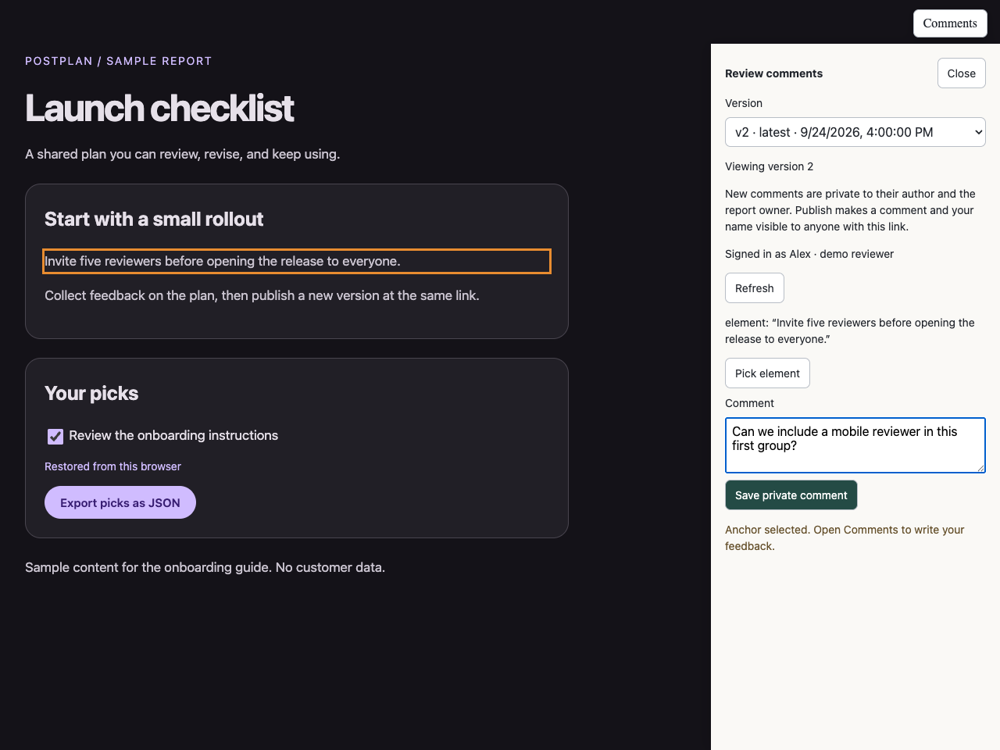
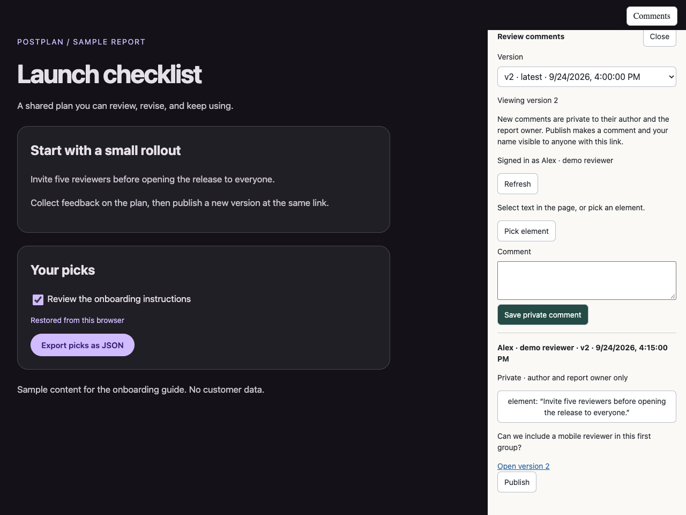
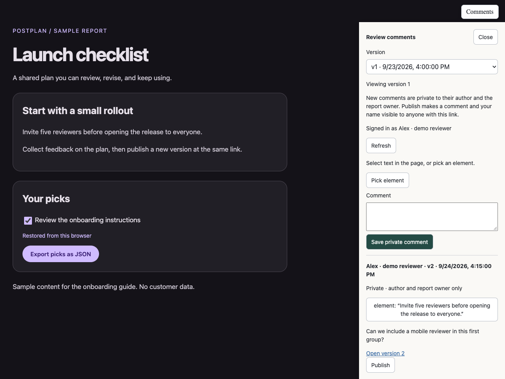
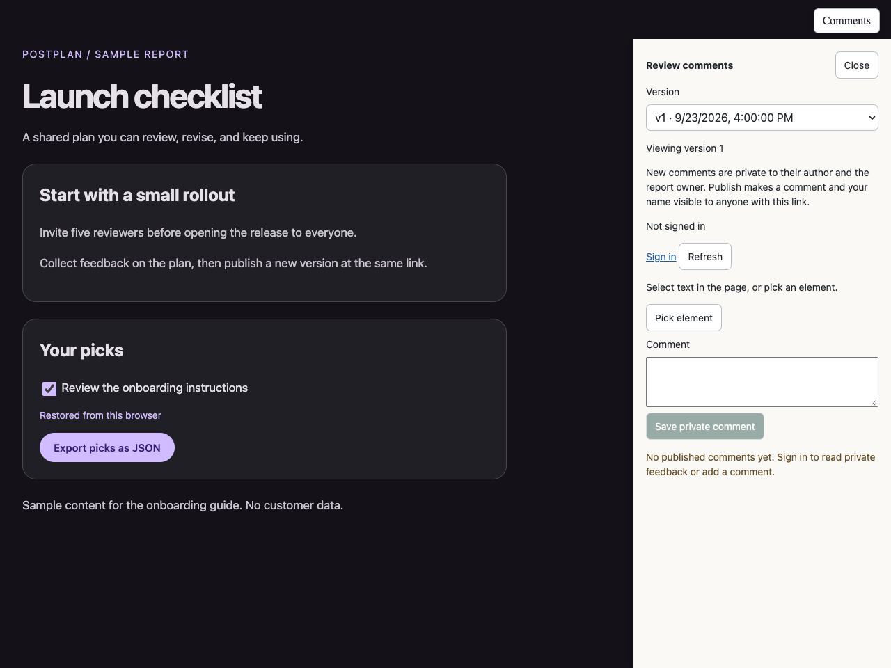
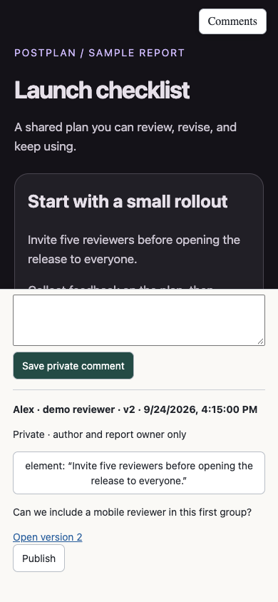
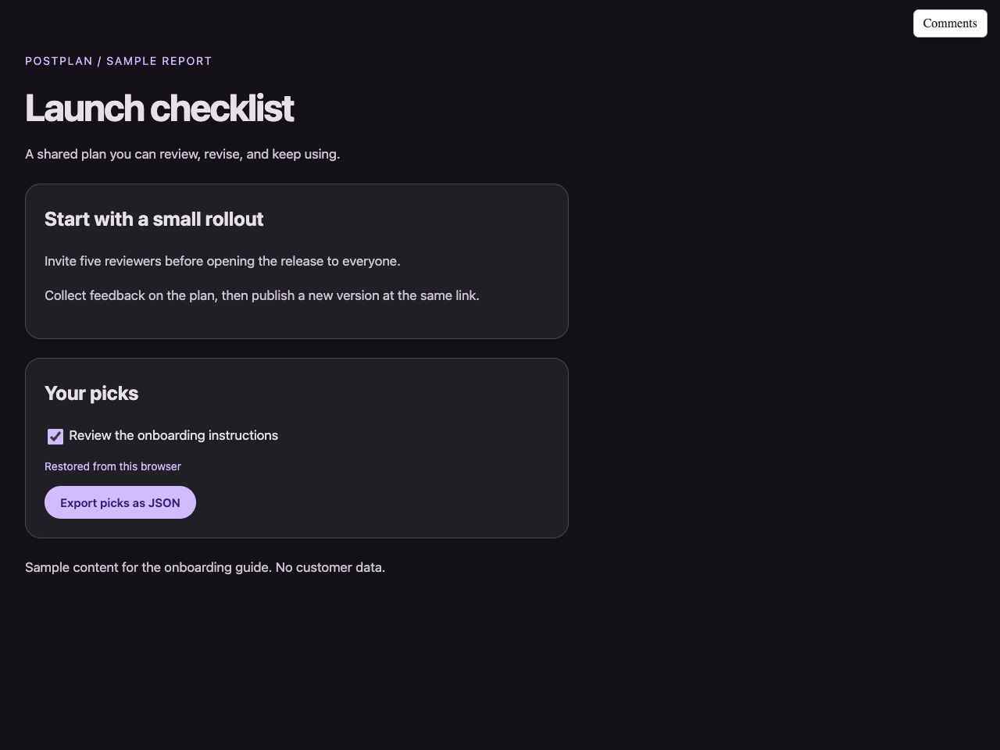

# Postplan, from first install to shared feedback

Publish an HTML report, send one link, and collect comments attached to the exact text or element being discussed. Update the report without changing its shared link.

This guide uses **Restot Postplan CLI v0.1.1** and **https://postplan.restot.top**. You need Node.js 22 or newer, npm, and your own account. Readers do not need the CLI. Reviewers sign in through Shoo to save comments or read private feedback they have access to. Published comments are readable without sign-in.

[Source and README](https://github.com/restot/postplan) · [Download v0.1.1](https://github.com/restot/postplan/releases/tag/v0.1.1) · [Shared post-report skill](../skills/post-report/SKILL.md)

## A1 · Install the CLI

These commands are for macOS or Linux. Check your prerequisites:

```sh
node --version  # must be v22 or newer
npm --version
```

Download both files from the release into a new working directory:

```sh
mkdir postplan-install
cd postplan-install
curl -fL -O https://github.com/restot/postplan/releases/download/v0.1.1/restot-postplan-0.1.1.tgz
curl -fL -O https://github.com/restot/postplan/releases/download/v0.1.1/SHA256SUMS
```

Verify the archive before installing. Use the command for your OS:

```sh
# macOS
shasum -a 256 -c SHA256SUMS

# Linux
sha256sum -c SHA256SUMS
```

Continue only if verification reports `OK`:

```sh
npm install --global --offline --ignore-scripts ./restot-postplan-0.1.1.tgz
postplan --version
postplan --help
```

The version should be `0.1.1`. The archive bundles its CLI dependencies, so the installation itself works offline. Downloading the archive and using the service still need internet access.

Do not use `npx postplan` or `npm install -g postplan`: those install the original package, not this build. Both use the command name `postplan`; check `command -v postplan` if you previously installed another version. Windows installation has not been tested.

## A2 · Sign in and configure your account

```sh
postplan auth login --api-url https://postplan.restot.top
```

Open the browser link printed by the CLI. Sign in with Shoo, create a personal API key, and paste it into the terminal prompt. Each friend uses their own account and key. Do not share someone else's key or paste one into an agent chat.

**The terminal prompt displays what you paste.** Do this outside screen sharing or terminal recordings. Then check the account:

```sh
postplan whoami
```

The CLI saves the base URL in `~/.postplan/config.json`, the key in `~/.postplan/credentials.json`, and file-to-draft mappings in `~/.postplan/drafts.json`. Do not commit or send these files. Browser sign-in and CLI authentication are separate; you may need to sign in again in the browser to comment.

If you use multiple deployments, set `POSTPLAN_CONFIG_DIR` to a separate directory before login and keep using that profile for later commands. `POSTPLAN_API_URL` and `POSTPLAN_API_KEY` override saved settings; stale environment variables can point commands at the wrong account or server.

## A3 · Publish your first page

Use an existing HTML report, or create a small starter file:

```sh
cat > hello.html <<'HTML'
<!doctype html>
<html lang="en">
<meta charset="utf-8">
<meta name="viewport" content="width=device-width, initial-scale=1">
<meta name="description" content="Our first shared plan">
<title>Our first plan</title>
<style>
  body { max-width: 48rem; margin: 3rem auto; padding: 0 1rem;
    background: #141218; color: #e6e0e9; font: 18px/1.6 system-ui; }
</style>
<h1>Our first plan</h1>
<p>Select this text to leave an anchored comment.</p>
</html>
HTML

postplan upload ./hello.html --description "Our first shared plan"
```

The CLI prints the public URL, draft ID and version. Open the URL and share it. Save the draft ID for feedback and management commands.

Upload one self-contained HTML file. Inline CSS and embedded images travel with it; relative image, CSS and JavaScript files do not. The server allows sandboxed JavaScript, but blocks forms, nested frames and direct fetch/XHR from uploaded pages.

**Anyone with the link can read the report without signing in.** Do not upload secrets or documents that require private sharing. The CLI also sends file hashes and available Git/CI metadata with uploads. Open source does not make uploaded content private.

## A4 · Use the review features

The screenshots below show the real application running locally with a sample report and a fictional reviewer. They are not private user plans. The sample checklist and export button belong to the uploaded HTML, not to Postplan's built-in interface.

### Pick the exact thing you mean

Open **Comments**, then select text in the report or press **Pick element** and click a paragraph, heading or other element. An orange outline shows the selected element. Write your feedback and press **Save private comment**. The outline stays until you save or choose another anchor.



*The quoted text in the panel is the anchor. This example asks for a mobile reviewer without changing the report itself.*

### Know who said what

Saved comments include the reviewer's display name, timestamp, version, comment body and anchor. **Private** means only the comment author and report owner can read it, including their authenticated CLI/agent access. Other reviewers cannot see it. Click the quoted anchor to locate it in the viewed version. For a comment on another version, use **Open version** first. Display names identify accounts; they are not verified legal identities.



*Comments stay separate from the uploaded HTML. Neither posting nor reading a comment edits your local source file.*

To share a saved comment with everyone, its author presses **Publish** and confirms. The comment, anchor and author name then become visible to anyone with the report link, even without sign-in. The report owner cannot publish a friend's comment for them. There is no comment-unpublish action. Previously stored comments were made private during this update; that cannot retract anything already read or copied.

### Browse previous versions

The **Version** picker at the top of Comments lists publication dates and marks the latest version. Selecting an entry opens that version and keeps the panel open. It works without sign-in. If you have an unposted comment, switching asks before discarding it.



*Here the viewer is on version 1, while the saved comment belongs to version 2. Old-version links preserve review context.*

### Check whether you are signed in

The panel says **Signed in as [name]** or **Not signed in**. While signed out, you can read the report, browse versions and read published comments. Private comments stay hidden and saving stays disabled. Use **Sign in**, complete Shoo login in the new tab, return, then press **Refresh**.



*CLI login does not sign this browser in. The disabled button is expected until the browser session is ready.*

### Review on a phone

On narrow screens, Comments opens as a bottom panel. Scroll inside it to reach the version picker, sign-in status or saved comments. Close the panel to read more of the page.



*Captured in mobile-sized Chromium. Native iOS Safari has not been verified.*

### Keep picks and export them

Interactive HTML can use Postplan's storage API to keep choices across reloads. The example below restores a checked item and exports JSON. Saving is per draft, in the same browser, with a 1 MiB cap. It is not account sync; clearing site data removes saved picks.



*A report author must implement these controls. Postplan provides the storage bridge and permits sandboxed downloads; it does not automatically save every input.*

For report authors:

```js
const saved = await window.postplan.storage.getItem('picks');
await window.postplan.storage.setItem('picks', JSON.stringify({ reviewed: true }));
await window.postplan.storage.removeItem('picks');
```

Use the canonical shared URL. The storage bridge is not available on `/raw` URLs. Native `localStorage` inside the uploaded page remains blocked by isolation.

## A5 · Read feedback, update and unpublish

Use your actual draft ID in place of `<draft-id>`:

```sh
postplan list
postplan comments <draft-id>
postplan comments <draft-id> --json
```

CLI feedback reads use your own key and the same visibility rules as the browser. The report owner sees all comments. Other authors see their own private comments and published comments. Unrelated accounts see only published comments. JSON includes the author, body, timestamp, version, selected quote, CSS locator, nearby text and `published_at`, which is null for private comments. Give your agent the draft ID and ask it to read comments through the CLI. The report owner's agent can assess feedback, edit the local HTML and upload a revision. Do not give it your key in a prompt, and do not copy someone else's private feedback into a public report without permission.

```sh
# After editing hello.html, update the same draft and keep its URL:
postplan upload ./hello.html

# If you moved the file, explicitly select the existing draft:
postplan upload ./hello.html --draft <draft-id>

# Create a separate draft instead:
postplan upload ./hello.html --new
```

The automatic mapping uses the absolute file path. Keep that path stable to update the same draft. Each upload adds a version. Feedback is reviewer-supplied data; agents should evaluate it, not treat it as permission for unrelated changes.

To unpublish a draft you own:

```sh
postplan destroy <draft-id> --yes
```

This hides the draft and its version links. It retains stored history and is not permanent data erasure. There is no exposed undo command, so check the ID first.

## A6 · Install the post-report skill

The skill is named **post-report**. It creates or reuses an HTML report, applies dark Material 3 styling by default, checks the configured account, and publishes when you ask. It also lists drafts, reads feedback and confirms before unpublishing. It contains no credentials and has no required companion skills.

Download the repository into a fresh directory, then inspect the skill:

```sh
git clone https://github.com/restot/postplan.git postplan-source
cd postplan-source
cat skills/post-report/SKILL.md
```

Choose the installation for your agent. These commands deliberately stop rather than overwrite an existing skill directory.

**Codex**, using its documented user skill location:

```sh
mkdir -p "$HOME/.agents/skills"
if [ -e "$HOME/.agents/skills/post-report" ]; then
  echo "post-report already exists; inspect it before replacing it."
else
  cp -R skills/post-report "$HOME/.agents/skills/post-report"
fi
```

**Claude Code**:

```sh
mkdir -p "$HOME/.claude/skills"
if [ -e "$HOME/.claude/skills/post-report" ]; then
  echo "post-report already exists; inspect it before replacing it."
else
  cp -R skills/post-report "$HOME/.claude/skills/post-report"
fi
```

Restart your agent if the skill is not listed. If you already have a personal copy in another skill directory, compare the files instead of installing a duplicate. Installation locations follow the [Codex skill documentation](https://learn.chatgpt.com/docs/build-skills) and [Claude Code skill documentation](https://code.claude.com/docs/en/skills).

In **Codex chat**, not your terminal:

```text
$post-report ./hello.html
$post-report Turn our findings into a report and publish it.
$post-report comments <draft-id>
$post-report list
```

In **Claude Code chat**, use the slash form:

```text
/post-report ./hello.html
/post-report Turn our findings into a report and publish it.
```

The skill runs `postplan` on PATH, using your configured account. It does not create an account, install the CLI, grant extra permissions or publish in the background without a request. Your original local customizations are not needed by friends.

## Troubleshooting

| Symptom | What to check |
| --- | --- |
| `postplan: command not found` | Check that your npm global bin directory is on PATH, then reopen the terminal. |
| Wrong CLI version or old restrictions | Run `command -v postplan`; install the release archive, not the original npm package. |
| Login or ownership error | Run `postplan whoami`. Use your own key for this deployment and check environment overrides. |
| Comments say Not signed in | Complete browser sign-in, return to the shared page and press Refresh. |
| A moved file creates a new URL | Use `--draft <draft-id>` to target the existing draft. |
| Picks disappear | Use the same browser/profile and canonical URL. The report must implement the storage API. |
| Slack does not show a preview | The canonical page has text metadata, not an automatic screenshot. Crawlers must be able to fetch it; proxy bot protection can block them. |

The app removes the former upload caps, but proxy limits and server capacity still apply. Keep a local copy of your reports. For your own deployment, see the server configuration and isolation notes in the [README](https://github.com/restot/postplan#run-your-own-server).

Guide and screenshots updated for private-by-default comments, September 24, 2026. Compatible with CLI v0.1.1. MIT licensed. No credentials, private reports or production account identities are included.
